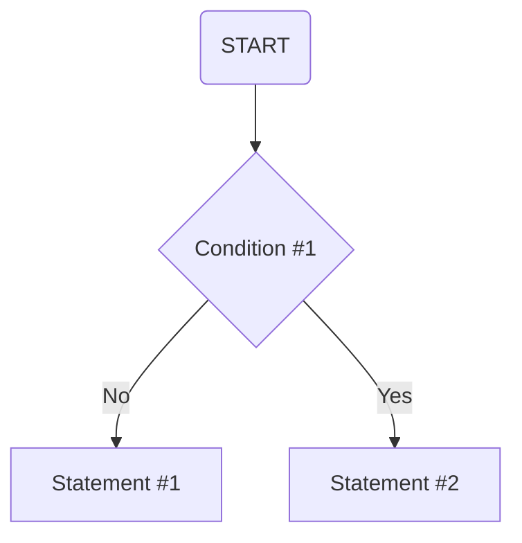

#

## Flowchart for Jupyter Notebook File Compression and Status Logging

> Condition #1: Check whether there exists a record for all Jupyter Notebook files in the current directory.

> Statement #1: If there does not exist a record for all Jupyter Notebook files in the current directory, create the record immediately，while generating the corresponding pre-compressed copy for each file and compressing all pre-compressed copies that exceed the preset size limit.

