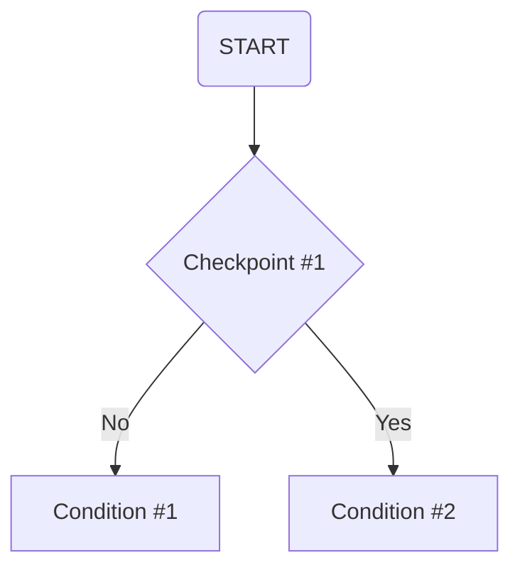

#

## Principle of Jupyter Notebook File Compression and State Logging



```
# Checkpoint #1: Check whether there exists a record of all Jupyter Notebook files in the current directory.

# Condition #1: If there does not exist a record of all Jupyter Notebook files in the current directory, create the record immediately and generate the corresponding pre-compressed copy at the same time, and then compress all pre-compressed copies that exceed the preset size limit.
```


