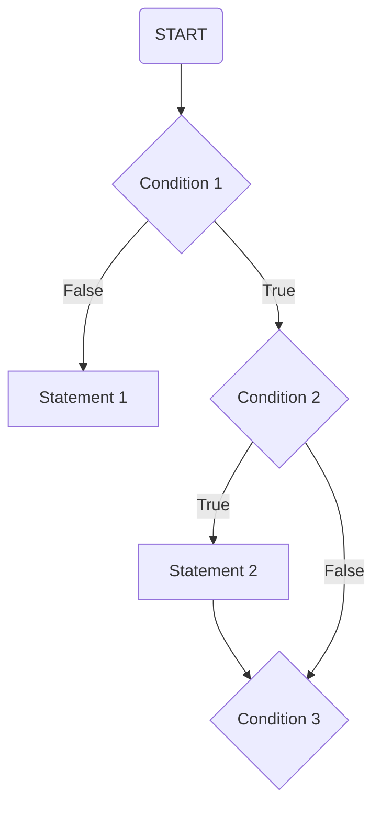

#

## Flowchart for Jupyter Notebook File Compression and Status Logging

> Condition 1: Check whether there exists a record for all Jupyter Notebook files in the current directory.

> Statement 1: If Condition 1 is False, create a record for all Jupyter Notebook files in the current directory immediately, while generating the corresponding pre-compressed copy for each file as well as compressing any copies that exceed the preset size limit.

> Condition 2: If Condition 1 is True, read this record and check whether there are certain entries in this record for which the corresponding Jupyter Notebook file cannot be found.

> Statement 2: If Condition 2 is True, delete those entries and reset the index.

> Condition 3: If Condition 2 is False, check all Jupyter Notebook files in the current directory, one by one, to see if there is any file that does not have a corresponding entry in this record.

