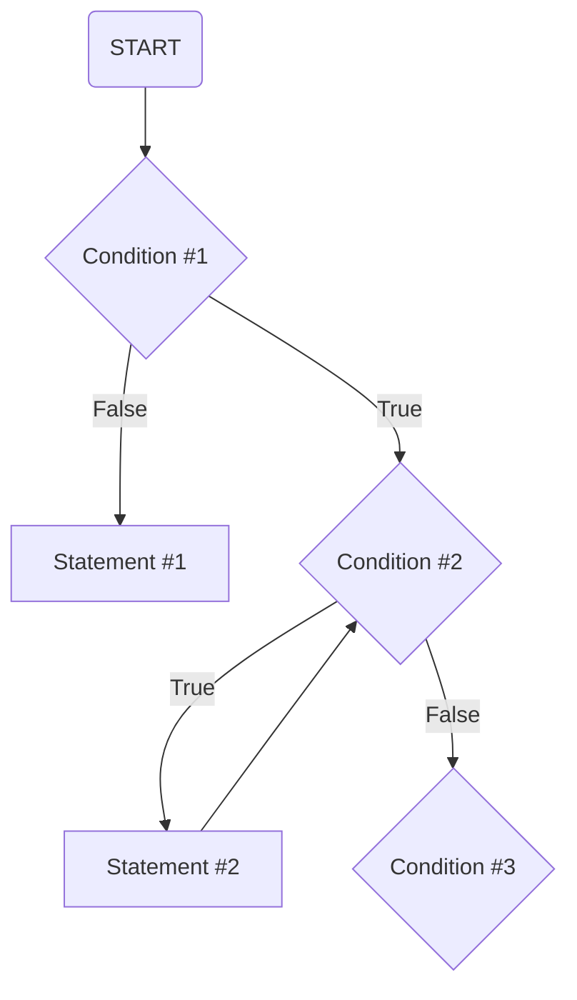

#

## Flowchart for Jupyter Notebook File Compression and Status Logging

> Condition #1: Check whether there exists a record for all Jupyter Notebook files in the current directory.

> Statement #1: If there does not exist a record for all Jupyter Notebook files in the current directory, create the record immediately，while generating the corresponding pre-compressed copy for each file and compressing all pre-compressed copies that exceed the preset size limit.

> Condition #2: Reads the records for all Jupyter Notebook files in the current directory. Check whether there are certain entries in this record for which the corresponding Jupyter Notebook file cannot be found.

> Statement #2: If there exist certain entries in this record for which the corresponding Jupyter Notebook file cannot be found, delete those entries and reset the index.

