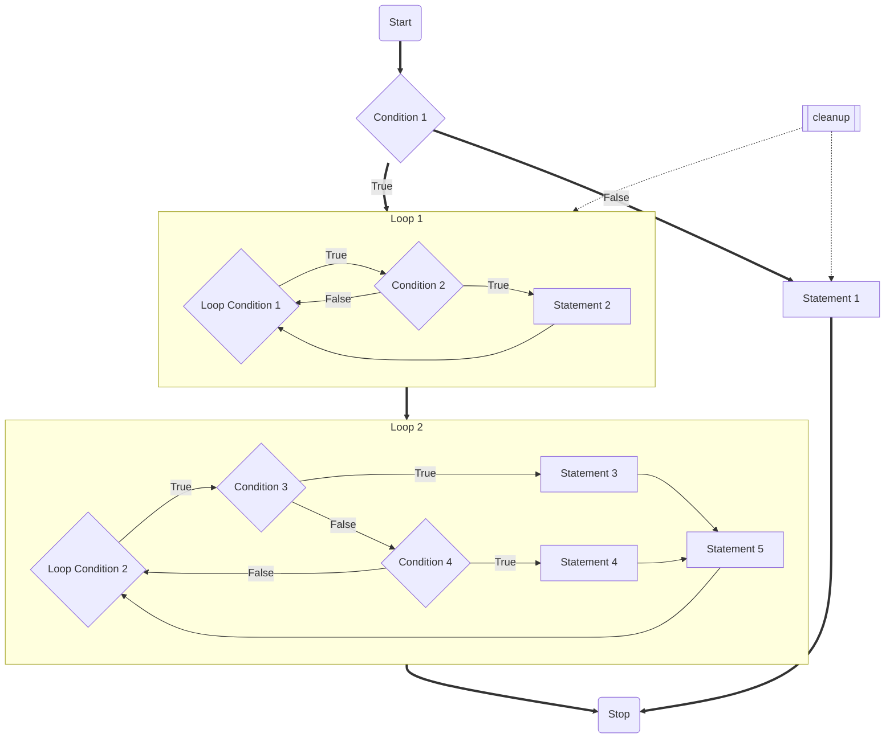

#

## Flowchart for Jupyter Notebook File Compression and Status Logging

> Condition 1: Check whether there exists a record for all Jupyter Notebook files in the current directory.
>
> Statement 1: If Condition 1 is False, create a record for all Jupyter Notebook files in the current directory immediately, while generating the corresponding pre-compressed copy for each file as well as compressing any copies that exceed the preset size limit, and recording relevant information about the copies.
>
> Condition 2: If Condition 1 is True, read this record and check whether there are certain entries in this record for which the corresponding Jupyter Notebook file cannot be found.
>
> Statement 2: If Condition 2 is True, delete these entries and eventually reset the index.
>
> Condition 3: Regardless of whether Condition 2 is True or False, check whether there are any Jupyter Notebook files in the current directory that do not have a corresponding entry in this record.
>
> Statement 3: If condition 3 is True, the information relating to the file will be added to the record as the most recent entry, and its corresponding indexes will be recorded separately in a list of indexes dedicated to recording altered or newly added entries.
>
> Condition 4: If condition 3 is False, check whether the actual modification date of the file is the same as the modification date recorded for the corresponding entry in the record.
>
> Statement 4: If condition 4 is True, update the modification date information and size information of the file to the corresponding entry in the record, and likewise record its corresponding index in the list of indexes dedicated to recording altered or newly added entries.
>
> Statement 5: Generates corresponding pre-compressed copies of the files corresponding to the entries in the records that correspond to all of the indexes in the list of indexes, compresses any copies that exceed the preset size limit, while recording information related to the corresponding copies.
>
> Statement 6: Sorts the updated record and resets its index.
